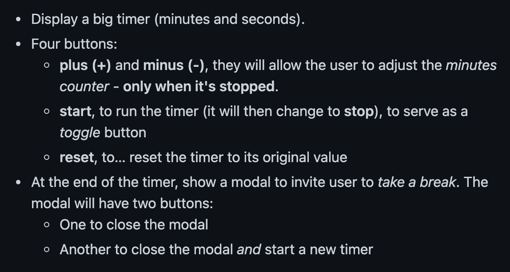

# react-pomodoro
introduction à REACT

## Cadre:
Cet exercice est effectué dans le cadre de la 17ième semaine de formation au centre de formation BECODE. 
Nous sommes en avril 2021.

## Technos utilisées:
* HTML5
* CSS3
* SASS
* Bootstrap
* React
* Prettier
* Linter
* Netlify

## Auteurs: 
Projet solo

## Instructions:
Créer un pomodoro avec react

Délai: 5 jours 

## Mission
image : 

## Statut:
terminé

## Projet déployé: 
Lien Github : https://github.com/RekhaLambotte/react-pomodoro

Lien web: https://loving-almeida-dbdb8b.netlify.app/
